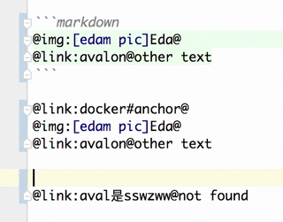

# quick-reference

[](https://travis-ci.org/be-fe/quick-reference)
[](https://codecov.io/github/be-fe/quick-reference?branch=master)
[](https://www.npmjs.com/package/quick-reference)
[](https://www.npmjs.com/package/quick-reference)

一种快速引用 markdown 资源（markdown、图片）的方式。

## 为什么

在层级深的 markdown 文档结构中，如下

```markdown
testdocs/
├── fsssww.md
├── imgs/
│ └── Edam.png
├── index.md
├── nodejs/
│ ├── fs.md
│ ├── index.md
│ └── module.md
├── test.md
├── test2.md
├── testss.md
├── 团队项目/
│ ├── cookbook/
│ │ ├── cookbook-v1.md
│ │ └── index.md
│ └── release-scripts/
│ └── index.md
├── 工具链/
│ └── docker/
│ └── docker.md
└── 技术栈/
├── avalon.md
└── avalon 监控属性的坑.md
```

我们在写一篇文章 A 的时候，想去引用（Reference）该文档中的其他文档或图片，我们需要去一层层 `../` 找到对应的目录，这样引用资源繁琐。

于是便有了 `quick-reference` 的用武之地，quick-reference 主张扁平文件结构，在以上层级较深的结构中，会被扁平化为：

```markdown
fsssww
Edam.png
index
nodejs
fs
module
test
test2
testss
cookbook
cookbook-v1
release-scripts
docker
avalon
avalon 监控属性的坑
```

我们可以用过下面的方式来指定扁平效果下的**唯一** id

可以在文章头部指定 permalink:

```markdown
---
permalink: hssss
---
```

如果 permalink 未被指定的话，将会使用文件名作为 permalink, 如 `fs.md` 被认为是 `fs`，同时 `nodejs/index.md` 中的 `index.md` 的 permalink 会被认为为 `nodejs`。

## 说明

有了上面的扁平文件的概念之后，通过下面的语法

    @link:premalink@  
    @link:[title]premalink@
    @img:premalink@
    @img:[title]premalink@

会自动转换成对应 permalink 的资源，link转换为`[...](...)`，img转换为``

效果如图展示：



## 使用

    npm install quick-reference -g

安装后，在项目的 package.json 中配置 (使用[cosmiconfig](https://github.com/davidtheclark/cosmiconfig))

    "quick-reference": {
      "docRoot": "path/to/docroot"
    }

```bash
# 开启文件监听服务，`-o` 表示覆写改动的文件，默认不开启
quick-reference-watch -o

# 同时可以不使用文件监听进程`-o`标志
# 使用 quick-reference进行转换亦可
quick-reference <...md files>
```

## 推荐的使用姿势

在开启了 `quick-reference-watch` 服务（不开启`-o`）后，在 IDE 中配置 `quick-reference` 进行 markdown 转换。

下面介绍在不同 IDE 中 `quick-reference` 的使用方式。

### WebStorm JetBrain

#### 方式一 (External Tools，快捷键触发)

- Preferences - External Tools
  

- New Tool
  

- Enable `quick-reference`, and apply the setting.
  

- Set Keymap for run `quick-reference`
  

#### 方法二（File Watcher，监控文件修改自动执行）


